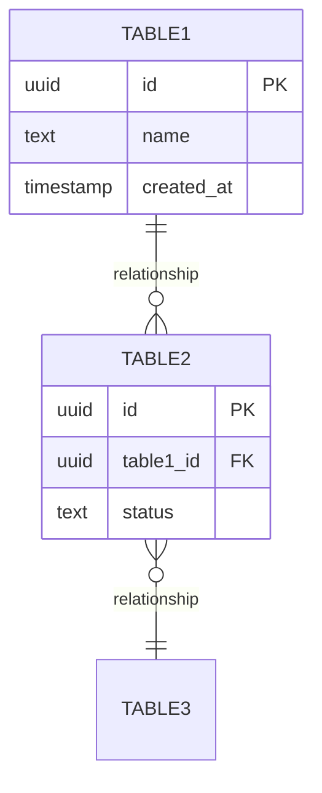

# Database Schema Documentation Template

Use this template when documenting database schemas. Keep it focused on essential information that developers and AI agents need.

---

## Template Structure

```markdown
# [Schema/Module] Database Schema

**Schema**: `schema_name`  
**Owner**: [Team/Module name]  
**Last Updated**: YYYY-MM-DD

## Overview

[1-2 paragraphs describing what this schema represents and how it fits into the system]

## Entity Relationship Diagram



[Only include ERD if it adds value. For simple schemas, skip it.]

## Tables

### `schema_name.table_name`

**Purpose**: [One sentence describing what this table stores]

**Row Count**: ~[Approximate scale: 100s, 1000s, 100K+]

**Columns**:

| Column | Type | Constraints | Default | Description |
|--------|------|-------------|---------|-------------|
| `id` | uuid | PK | gen_random_uuid() | Unique identifier |
| `org_id` | uuid | NOT NULL, FK | - | Organization owner |
| `name` | text | NOT NULL | - | Display name |
| `status` | text | NOT NULL | 'active' | Status (active\|archived\|deleted) |
| `metadata` | jsonb | - | '{}' | Flexible metadata storage |
| `created_at` | timestamptz | NOT NULL | now() | Creation timestamp |
| `updated_at` | timestamptz | NOT NULL | now() | Last update timestamp |

**Indexes**:
- `idx_table_org_id` (org_id) - For org-based queries
- `idx_table_status` (status) WHERE status = 'active' - Partial index for active records
- `idx_table_created` (created_at DESC) - For chronological queries
- `idx_table_metadata` (metadata) USING GIN - For JSONB queries

**Foreign Keys**:
- `org_id` → `core.organizations(id)` ON DELETE CASCADE
- `user_id` → `core.users(id)` ON DELETE SET NULL

**Triggers**:
- `set_updated_at` - Updates `updated_at` on row modification
- `validate_status` - Ensures valid status transitions

**RLS (Row-Level Security)**:
- Enabled: ✅
- Policy: Users can only access records where `org_id` matches their organization
- Policy name: `org_isolation_policy`

### [Repeat for each table]

## Common Queries

### Query Pattern 1: [Description]

```sql
SELECT * 
FROM schema_name.table_name
WHERE org_id = $1
  AND status = 'active'
ORDER BY created_at DESC
LIMIT 50;
```

**Performance**: ~10ms with index

### Query Pattern 2: [Description]

```sql
SELECT 
  t1.*,
  t2.name as related_name
FROM schema_name.table1 t1
JOIN schema_name.table2 t2 ON t1.foreign_key = t2.id
WHERE t1.org_id = $1;
```

**Performance**: ~25ms with proper indexes

### JSONB Queries (if applicable)

```sql
-- Query metadata
SELECT * 
FROM table_name
WHERE metadata @> '{"key": "value"}'::jsonb;

-- Check key exists
SELECT * 
FROM table_name
WHERE metadata ? 'customField';

-- Extract value
SELECT 
  id,
  metadata->>'customField' as custom_field
FROM table_name;
```

## Migrations

**Applied**:
- `001_initial_schema.sql` (2024-01-10) - Initial tables
- `002_add_metadata.sql` (2024-02-15) - Added JSONB metadata
- `003_performance_indexes.sql` (2024-03-20) - Added GIN indexes

**Pending**: None

**Migration Tool**: [Flyway, Liquibase, Prisma, custom, etc.]

## Data Integrity

**Constraints**:
- `org_id` must reference existing organization
- `status` must be one of: 'active', 'archived', 'deleted'
- `email` must match format validation (application layer)

**Validation**:
- JSONB metadata validated against JSON Schema (application layer)
- Date ranges validated (start_date < end_date)

**Cascading Behavior**:
- When organization deleted → all related records deleted (CASCADE)
- When user deleted → user_id set to NULL (SET NULL)

## Performance Considerations

- **Query Performance**: Most queries <50ms with proper indexes
- **Partitioning**: Consider partitioning by `created_at` if exceeds 10M rows
- **Archival**: Archive records older than 2 years with status='deleted'
- **Vacuum**: Auto-vacuum configured, manual vacuum before major operations

## Backup & Recovery

- **Backup Schedule**: Daily full, hourly incremental
- **Retention**: 30 days
- **RTO**: 4 hours
- **RPO**: 1 hour

## Related Documentation

- [Module README](../modules/name/README.md)
- [API Documentation](./api/name.md)
- [ADR-042: JSONB Metadata](./architecture/adr-042-jsonb-metadata.md)
```

---

## Example: Real Schema Documentation

### Proposals Database Schema

**Schema**: `modules_proposal`  
**Owner**: Proposal Module  
**Last Updated**: 2025-01-15

## Overview

The proposals schema stores AI-generated proposal variants, client information, and proposal state. Each proposal can have multiple variants (typically 3-5), representing different approaches to a client's requirements. Proposals are organization-scoped and include comprehensive tracking of generation costs (Q-Units), client feedback, and acceptance status.

## Tables

### `modules_proposal.proposals`

**Purpose**: Main proposal records tracking AI-generated proposal sessions

**Row Count**: ~50K (growing ~500/day)

**Columns**:

| Column | Type | Constraints | Default | Description |
|--------|------|-------------|---------|-------------|
| `id` | uuid | PK | gen_random_uuid() | Unique proposal ID |
| `org_id` | uuid | NOT NULL, FK | - | Organization owner |
| `client_id` | uuid | NOT NULL, FK | - | Target client |
| `requirements` | text | NOT NULL | - | Client requirements (50-5000 chars) |
| `status` | text | NOT NULL | 'draft' | Status: draft\|sent\|accepted\|rejected |
| `selected_variant_id` | uuid | FK | NULL | ID of chosen variant |
| `q_units_used` | integer | NOT NULL | - | Q-Units consumed for generation |
| `metadata` | jsonb | - | '{}' | Flexible metadata |
| `created_by` | uuid | FK | - | User who created |
| `created_at` | timestamptz | NOT NULL | now() | Creation timestamp |
| `sent_at` | timestamptz | - | NULL | When sent to client |
| `responded_at` | timestamptz | - | NULL | When client responded |

**Indexes**:
- `idx_proposals_org_status` (org_id, status) - Most common query pattern
- `idx_proposals_client` (client_id) - Client proposal history
- `idx_proposals_created` (created_at DESC) - Chronological queries
- `idx_proposals_metadata` (metadata) USING GIN - JSONB queries

**Foreign Keys**:
- `org_id` → `core.organizations(id)` ON DELETE CASCADE
- `client_id` → `modules_crm.clients(id)` ON DELETE CASCADE
- `created_by` → `core.users(id)` ON DELETE SET NULL

**RLS**: Enabled, org-scoped access

### `modules_proposal.variants`

**Purpose**: Individual proposal variants within a proposal session

**Row Count**: ~200K (3-5 per proposal)

**Columns**:

| Column | Type | Constraints | Default | Description |
|--------|------|-------------|---------|-------------|
| `id` | uuid | PK | gen_random_uuid() | Unique variant ID |
| `proposal_id` | uuid | NOT NULL, FK | - | Parent proposal |
| `title` | text | NOT NULL | - | Variant title |
| `summary` | text | NOT NULL | - | Executive summary |
| `content` | jsonb | NOT NULL | - | Full proposal content |
| `estimated_cost` | integer | NOT NULL | - | Estimated cost in cents |
| `timeline_weeks` | integer | NOT NULL | - | Estimated timeline |
| `tone` | text | NOT NULL | - | Tone used: professional\|casual\|technical |
| `created_at` | timestamptz | NOT NULL | now() | Generation timestamp |

**Indexes**:
- `idx_variants_proposal` (proposal_id) - Lookup variants for proposal
- `idx_variants_content` (content) USING GIN - Full-text search on content

**Foreign Keys**:
- `proposal_id` → `modules_proposal.proposals(id)` ON DELETE CASCADE

## Common Queries

### Get Active Proposals for Organization

```sql
SELECT 
  p.*,
  c.name as client_name,
  u.email as creator_email,
  COUNT(v.id) as variant_count
FROM modules_proposal.proposals p
JOIN modules_crm.clients c ON p.client_id = c.id
LEFT JOIN core.users u ON p.created_by = u.id
LEFT JOIN modules_proposal.variants v ON p.id = v.proposal_id
WHERE p.org_id = $1
  AND p.status IN ('draft', 'sent')
GROUP BY p.id, c.name, u.email
ORDER BY p.created_at DESC
LIMIT 50;
```

**Performance**: ~15ms (uses `idx_proposals_org_status`)

### Get Proposal with All Variants

```sql
SELECT 
  p.*,
  json_agg(
    json_build_object(
      'id', v.id,
      'title', v.title,
      'summary', v.summary,
      'estimated_cost', v.estimated_cost,
      'timeline_weeks', v.timeline_weeks
    ) ORDER BY v.created_at
  ) as variants
FROM modules_proposal.proposals p
LEFT JOIN modules_proposal.variants v ON p.id = v.proposal_id
WHERE p.id = $1
GROUP BY p.id;
```

**Performance**: ~20ms for typical proposal (3-5 variants)

### Search Proposals by Content

```sql
SELECT DISTINCT p.*
FROM modules_proposal.proposals p
JOIN modules_proposal.variants v ON p.id = v.proposal_id
WHERE p.org_id = $1
  AND v.content @> '{"requirements": ["e-commerce"]}'::jsonb
ORDER BY p.created_at DESC;
```

**Performance**: ~40ms (uses GIN index on variants.content)

## Migrations

**Applied**:
- `001_initial_schema.sql` (2024-11-01) - Initial tables
- `002_add_metadata.sql` (2024-12-15) - Added JSONB metadata column
- `003_performance_indexes.sql` (2025-01-10) - Added GIN indexes
- `004_add_client_response.sql` (2025-01-15) - Added responded_at column

**Pending**: None

**Migration Tool**: Custom SQL migrations via pnpm db:migrate

## Data Integrity

**Constraints**:
- Proposals must have 3-5 variants
- `requirements` must be 50-5000 characters
- `status` transitions: draft → sent → accepted|rejected
- Cannot delete proposal after sending (soft delete via status)

**Validation** (Application Layer):
- Variants content validated against JSON Schema
- Timeline must be realistic (1-52 weeks)
- Cost must be positive

**Cascading**:
- Delete organization → delete all proposals (CASCADE)
- Delete client → delete proposals (CASCADE) 
- Delete proposal → delete all variants (CASCADE)

## Performance Considerations

- **Average Query Time**: <20ms for typical queries
- **Hot Data**: Last 30 days (90% of queries)
- **Archival Strategy**: Move proposals older than 2 years with status='rejected' to cold storage
- **Partitioning**: Not yet needed, consider when >10M rows
- **Cache Strategy**: Cache proposal summaries at application layer (Redis, 1 hour TTL)

## Related Documentation

- [Proposal Module README](../modules/proposal-builder/README.md)
- [Proposal API](./api/proposals.md)
- [ADR-042: JSONB for Metadata](./architecture/adr-042-jsonb-metadata.md)
- [Q-Units Pricing](../guides/q-units.md)

---

## Schema Documentation Best Practices

### What to Include

✅ **Include**:
- Table purposes (one sentence each)
- Column types and constraints
- Most common query patterns
- Performance characteristics
- RLS policies if applicable
- Foreign key relationships

❌ **Don't include**:
- Every possible query variation
- Application logic (belongs in code)
- Historical migration rationale (use ADRs)
- Obvious information ("id is primary key")
- Example data (unless it clarifies structure)

### When to Update

Update schema documentation when:
- Adding/removing tables
- Adding/removing columns
- Changing indexes
- Changing RLS policies
- Query patterns change significantly

Don't update for:
- Data changes (that's not schema)
- Minor index tweaks
- Temporary experiments

### Context Efficiency

Keep schema docs under 500 lines. If larger:
- Split by domain (e.g., `schema-proposals.md`, `schema-invoices.md`)
- Move historical migrations to separate file
- Link to detailed query optimization docs
- Use ERD only when relationships are complex

### Testing Queries

- Test all documented queries before committing
- Include realistic data volumes
- Note performance with indexes
- Update when performance degrades
